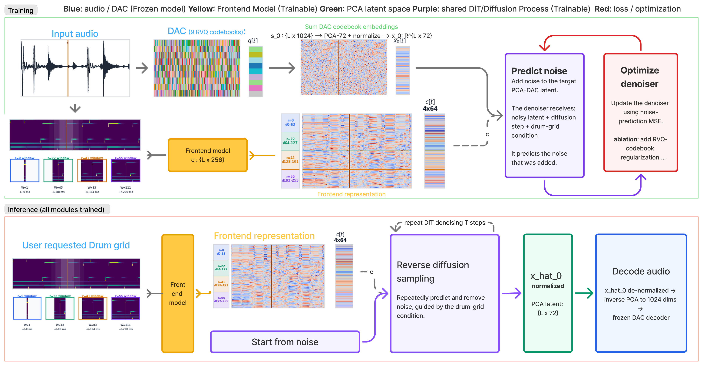
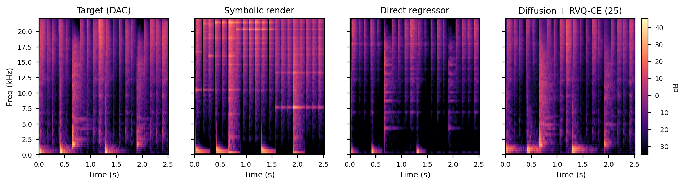

# Grid2Drum-DAC

Drum-grid–conditioned audio generation via latent diffusion in a PCA subspace of the DAC codec.

**▶ Try it in your browser: [Grid2Drum-DAC listener on Hugging Face](https://huggingface.co/spaces/soilkon/grid2drum-dac-listener)** — generate drum audio from a grid, or compare generated, regressor-baseline, and ground-truth audio for held-out examples.

Source: [github.com/kostantinos-soiledis/grid2drum_dac](https://github.com/kostantinos-soiledis/grid2drum_dac)

## How it works



**Training (top):** target audio is encoded by a frozen [DAC](https://github.com/descriptinc/descript-audio-codec) codec (9 RVQ codebooks); the summed codebook embeddings are projected to a normalized 72-dim PCA latent sequence. A trainable multiscale frontend turns the drum grid into a conditioning sequence, and a shared DiT denoiser is trained with noise-prediction MSE (optionally with RVQ-codebook regularization).

**Inference (bottom):** the user-requested drum grid goes through the frontend, reverse diffusion sampling starts from noise guided by that conditioning, and the predicted PCA latent is de-normalized, inverse-projected back to 1024 dims, and decoded to 44.1 kHz audio by the frozen DAC decoder.

Qualitative comparison against the direct PCA-regressor baseline:



## Drum grid representation

The model is conditioned on a MIDI-derived grid rendered at **250 Hz** over each
four-beat excerpt of duration `D` seconds (`G = round(250·D)` frames). The
renderer is `code/experiment/data/family_state_cache_utils.py`.

### Channels (43 total)

- **24 numeric rows**: for each of 8 drum families (kick, snare, tom_high,
  tom_mid, tom_floor, hihat, crash, ride), interleaved per family:
  - `state_vel`: velocity × envelope; it describes the strike as it rings;
  - `onset_vel`: the strike velocity, only in the onset frame;
  - `onset_count`: the number of strikes in the frame.
- **19 articulation one-hot rows**, expanded from one articulation ID per family
  and frame. Frames with no ID (−1) give all-zero rows. The kick has only one
  articulation, so it gets no row.

MIDI velocities are divided by 127 and clipped to [0, 1]. A strike at time `t`
(relative to the excerpt start) lands in frame `round(t·G/D)`, clipped to
`[0, G−1]`.

### Pitch → family / articulation ID

| Family | ID: articulation (GMD MIDI pitch) | One-hot rows |
| --- | --- | ---: |
| kick | 0: kick (35, 36) | 0 |
| snare | 0: head (38) · 1: rim (40) · 2: cross-stick (37) | 3 |
| tom_high | 0: head (48) · 1: rim (50) | 2 |
| tom_mid | 0: head (45) · 1: rim (47) | 2 |
| tom_floor | 0: head (41, 43) · 1: rim (58) | 2 |
| hihat | 0: open bow (46) · 1: open edge (26) · 2: closed bow (42) · 3: closed edge (22) · 4: pedal (44) | 5 |
| crash | 0: bow (49, 57) · 1: edge (52, 55) | 2 |
| ride | 0: bow (51) · 1: edge (59) · 2: bell (53) | 3 |

Other pitches are ignored.

### State envelope

Each strike draws an envelope over the frames after its onset:

1. **Attack**: a linear rise over the attack time, never below 0.15.
2. **Body**: holds at 1.0 until the body time.
3. **Decay**: exponential, reaching 0.01 at the decay time; rendering stops there.

| Family | Attack / body / decay / carryover (ms) |
| --- | --- |
| kick | 12 / 120 / 180 / 200 |
| snare | 12 / 120 / 220 / 220 |
| tom_high | 12 / 140 / 280 / 280 |
| tom_mid | 12 / 150 / 320 / 320 |
| tom_floor | 12 / 160 / 360 / 360 |
| hihat open (IDs 0, 1) | 20 / 110 / 520 / 520 |
| hihat closed (IDs 2, 3) | 20 / 70 / 180 / 180 |
| hihat pedal (ID 4) | 20 / 50 / 120 / 180 |
| crash | 12 / 220 / 2200 / 2200 |
| ride | 12 / 140 / 760 / 760 |

Special cases:

- **Ghost notes.** Snare-head strikes with velocity ≤ 0.25 have their body and
  decay times scaled by 0.45. Kick strikes with velocity ≤ 0.22 are scaled by 0.5.
- **Overlapping strikes (same family).** Strikes are processed in time order.
  A new strike takes over every frame where its envelope shape is at least as
  high as the current one. The comparison uses the shape, not the velocity.
- **Hi-hat choke.** Every hi-hat strike (open, closed or pedal) clears the
  existing hi-hat state from its onset onward. A closed or pedal hit therefore
  cuts off a ringing open hi-hat.
- **Onset frame.** In the onset frame, `onset_vel` and `state_vel` take the
  maximum with the strike velocity, and `onset_count` goes up by one (capped
  at 255). The articulation ID is overwritten, so if two strikes of one family
  ever share a frame, the later one's ID is kept.
- **Carryover.** A strike up to its carryover time before the excerpt start
  still contributes its decaying state, but no onset. The look-back is at most
  2.2 s. For a user-drawn grid with nothing before it, the carryover is empty.

Grids are zero-padded to `G` frames (articulation IDs are padded with −1).

### How the model reads the grid

Each codec frame `ℓ` (86.13 Hz, center time `τ_ℓ`) reads the grid through
windows centered at `τ_ℓ`, with samples at `τ_ℓ + m·D/G` for `m = −r … r`.
Windows are placed by time in seconds, not by grid index.

- State rows are linearly interpolated.
- Onsets, counts and articulation IDs use nearest-neighbor sampling.
- Queries past either end are clamped to the first or last grid frame.

Four branches use radii `r ∈ {0, 22, 41, 55}` grid steps (≈ 0, ±88, ±164,
±220 ms). The nonzero radii were chosen on training data: they are the
offsets where the cumulative grid–latent correlation score reaches 50/75/90%
(`code/experiment/scripts/analyze_frontend_radii.py`).

The grid-rate ablation decimates this 250 Hz grid when it is loaded
(`code/experiment/data/grid_rate_downsample.py`):

- velocities take the maximum over each group of frames;
- counts are summed;
- the articulation ID comes from the loudest onset in the group.

## Using the repo

The full pipeline is cache → train → evaluate. Every script accepts `--help`
for the complete option list; the commands below show the main entry points.

### 1. Build caches

```bash
# Beat-level source cache from the Groove MIDI Dataset
# (audio -> codec tokens + aligned drum grids)
python code/experiment/scripts/build_source_cache.py \
  --source-root /path/to/gmd \
  --out-root runs/source_cache \
  --codec-family dac \
  --split train \
  --device cuda

# Framewise diffusion cache (PCA targets + seconds-grid conditioning)
python code/experiment/scripts/build_diffusion_cache.py \
  --source-cache-root runs/source_cache \
  --out-root runs/diffusion_cache \
  --split train
```

### 2. Train

```bash
# Latent diffusion model (DiT denoiser + frontend)
python code/experiment/train_cli.py \
  --cache-root runs/diffusion_cache \
  --out-dir runs/my_diffusion \
  --device cuda

# Sketch expander (drum-grid sketch -> conditioning)
python code/experiment/train_sketch_expander_cli.py \
  --cache-root runs/diffusion_cache \
  --out-dir runs/my_sketch_expander
```

### 3. Evaluate

```bash
python code/experiment/scripts/run_diffusion_acoustic_eval.py \
  --checkpoint runs/runs_dac/dac_25steps/best_diffusion.pt \
  --cache-root runs/diffusion_cache \
  --split test
```

Exports predictions and runs the acoustic evaluation (metrics, FAD, plots).
The paper's aggregated metrics and full evaluation outputs live under
[results/paper_results/](results/paper_results/), and
`code/experiment/scripts/build_paper_results.py` reassembles them.

The paper's paired confidence intervals and significance tests come from
`code/experiment/scripts/clustered_paired_stats.py`. It clusters by source
recording: a percentile bootstrap over recordings, plus sign-flip permutation
tests that flip all clips of a recording together (the paper uses
`--reps 5000 --seed 1234`). It reads a per-clip metrics CSV and needs no GPU.

## Paper runs and metric settings

### Runs and selected epochs

All runs use seed 1234, AdamW (learning rate and weight decay 1e−4), batch
size 4 and gradient clipping at 1. The checkpoint with the lowest validation
loss is kept (for auxiliary runs, the validation loss includes the RVQ
cross-entropy term).

| System | Run directory under `runs/` | Budget (epochs) | Selected epoch |
| --- | --- | ---: | ---: |
| Direct regression, 6 layers (76.50 M) | `runs_direct/direct_pca_d1024_l6_seed1234` | 150 | 14 |
| Direct regression, 8 layers (101.69 M) | `runs_direct/direct_pca_d1024_l8_seed1234` | 150 (stopped at 78) | 12 |
| Plain diffusion, 6 steps | `runs_dac/dac_6steps` | 150 | 148 |
| Plain diffusion, 12 steps | `runs_dac/dac_12steps` | 150 | 133 |
| Plain diffusion, 25 steps | `runs_dac/dac_25steps` | 150 | 148 |
| Plain diffusion, 50 steps | `runs_dac/dac_50steps` | 150 | 146 |
| Auxiliary diffusion, 6 steps | `runs_dac_ce/dac_6steps` | 150 | 143 |
| Auxiliary diffusion, 12 steps | `runs_dac_ce/dac_12steps` | 150 | 143 |
| Auxiliary diffusion, 25 steps | `runs_dac_ce/dac_25steps` | 150 | 146 |
| Auxiliary diffusion, 25 steps, 90 Hz grid | `runs_dac_ce/grid_rate_ablation/grid90hz_25steps` | 75 | 72 |
| Auxiliary diffusion, 25 steps, 120 Hz grid | `runs_dac_ce/grid_rate_ablation/grid120hz_25steps` | 75 | 72 |

Conditioning ablations (zero grid, single-scale linear encoders with r = 0 and
r = 22) use a 75-epoch budget. No 50-step auxiliary model was trained.

Main-table exports use:

- sampling seed 1234, batch size 8, one sample per grid;
- the predicted x₀ clipped to [−6, 6];
- no beat-boundary crossfade.

The grid-rate arms were exported with a 10 ms beat crossfade and batch size 4.

### Metric settings

All metrics compare against DAC-decoded cached targets, not the original
recordings. Predictions are trimmed or zero-padded to the reference length,
and no time-shift alignment is applied.

- **Log-mel MAE (dB):**
  - centered Hann STFT, FFT/window 1024, hop 256;
  - 80 HTK mel bands over 20–14,000 Hz;
  - `10·log10(max(power, 1e−8))`;
  - each waveform is first normalized to unit peak.
- **Flux cosine similarity:**
  - the cosine between the reference and generated spectral-flux curves;
  - each curve is the frequency-averaged, half-wave-rectified frame-to-frame
    increase in STFT magnitude (same STFT, unit-peak normalization);
  - 0 is returned for degenerate norms.
- **Waveform L1 and MR-STFT:**
  - each clip is peak-normalized to 0.95 separately;
  - MR-STFT averages the L1 distance of `log1p(|STFT|)` over (FFT, hop) =
    (512, 128), (1024, 256), (2048, 512), with valid-frame masks.
- **FAD∞:**
  - `clap-laion-music` embeddings;
  - FAD is computed on bootstrap subsets at 25 sizes (from 500 embeddings up
    to the full set), fitted linearly against 1/n and extrapolated to
    n → ∞;
  - the result is averaged over 8 deterministic repeats (base seed 20260404).
- **Paired statistics:** source-recording-clustered, via
  `clustered_paired_stats.py` (see above).

Peak normalization means none of these metrics measure absolute gain or
loudness.
