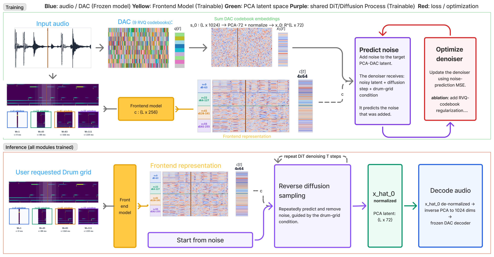
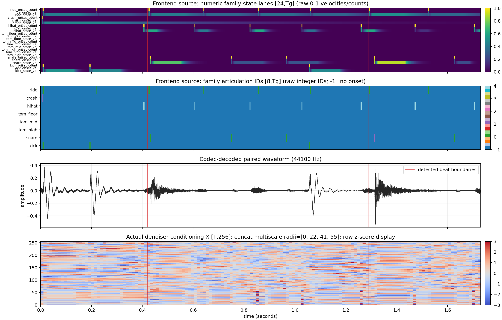
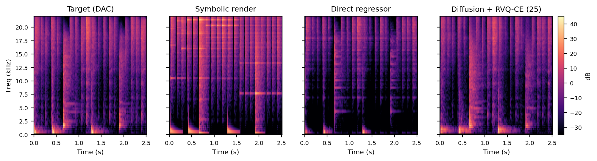

# Grid2Drum-DAC

Drum-grid–conditioned audio generation via latent diffusion in a PCA subspace of the DAC codec.

**▶ Listen first: [live demo page](https://anonymous.4open.science/w/grid2drum_dac-A24F/)** — side-by-side generated, regressor-baseline, and ground-truth drum audio for held-out examples, plus the final results tables.

## How it works



**Training (top):** target audio is encoded by a frozen [DAC](https://github.com/descriptinc/descript-audio-codec) codec (9 RVQ codebooks); the summed codebook embeddings are projected to a normalized 72-dim PCA latent sequence. A trainable multiscale frontend turns the drum grid into a conditioning sequence, and a shared DiT denoiser is trained with noise-prediction MSE (optionally with RVQ-codebook regularization).

**Inference (bottom):** the user-requested drum grid goes through the frontend, reverse diffusion sampling starts from noise guided by that conditioning, and the predicted PCA latent is de-normalized, inverse-projected back to 1024 dims, and decoded to 44.1 kHz audio by the frozen DAC decoder.

What the model is conditioned on, for one test excerpt:



From top to bottom:

1. the 24 numeric family-state lanes (state velocity, onset velocity and onset
   count per family);
2. the per-family articulation IDs (−1 = no onset);
3. the paired DAC-decoded waveform, with detected beat boundaries in red;
4. the 256-D conditioning sequence the denoiser actually receives: the
   concatenated output of the four frontend branches (radii 0, 22, 41, 55),
   z-scored per row for display.

The grid details are described next.

## Drum grid representation

The model is conditioned on a MIDI-derived grid rendered at **250 Hz** over each
four-beat excerpt of duration `D` seconds (`G = round(250·D)` frames). The
renderer is `code/experiment/data/family_state_cache_utils.py`.

### Channels (43 total)

- **24 numeric rows**: for each of 8 drum families (kick, snare, tom_high,
  tom_mid, tom_floor, hihat, crash, ride), interleaved per family:
  - `state_vel`: velocity × envelope; it describes the strike as it rings;
  - `onset_vel`: the strike velocity, only in the onset frame;
  - `onset_count`: the number of strikes in the frame.
- **19 articulation one-hot rows**, expanded from one articulation ID per family
  and frame. Frames with no ID (−1) give all-zero rows. The kick has only one
  articulation, so it gets no row.

MIDI velocities are divided by 127 and clipped to [0, 1]. A strike at time `t`
(relative to the excerpt start) lands in frame `round(t·G/D)`, clipped to
`[0, G−1]`.

### Pitch → family / articulation ID

| Family | ID: articulation (GMD MIDI pitch) | One-hot rows |
| --- | --- | ---: |
| kick | 0: kick (35, 36) | 0 |
| snare | 0: head (38) · 1: rim (40) · 2: cross-stick (37) | 3 |
| tom_high | 0: head (48) · 1: rim (50) | 2 |
| tom_mid | 0: head (45) · 1: rim (47) | 2 |
| tom_floor | 0: head (41, 43) · 1: rim (58) | 2 |
| hihat | 0: open bow (46) · 1: open edge (26) · 2: closed bow (42) · 3: closed edge (22) · 4: pedal (44) | 5 |
| crash | 0: bow (49, 57) · 1: edge (52, 55) | 2 |
| ride | 0: bow (51) · 1: edge (59) · 2: bell (53) | 3 |

Other pitches are ignored.

### State envelope

Each strike draws an envelope over the frames after its onset:

1. **Attack**: a linear rise over the attack time, never below 0.15.
2. **Body**: holds at 1.0 until the body time.
3. **Decay**: exponential, reaching 0.01 at the decay time; rendering stops there.

| Family | Attack / body / decay / carryover (ms) |
| --- | --- |
| kick | 12 / 120 / 180 / 200 |
| snare | 12 / 120 / 220 / 220 |
| tom_high | 12 / 140 / 280 / 280 |
| tom_mid | 12 / 150 / 320 / 320 |
| tom_floor | 12 / 160 / 360 / 360 |
| hihat open (IDs 0, 1) | 20 / 110 / 520 / 520 |
| hihat closed (IDs 2, 3) | 20 / 70 / 180 / 180 |
| hihat pedal (ID 4) | 20 / 50 / 120 / 180 |
| crash | 12 / 220 / 2200 / 2200 |
| ride | 12 / 140 / 760 / 760 |

Special cases:

- **Ghost notes.** Snare-head strikes with velocity ≤ 0.25 have their body and
  decay times scaled by 0.45. Kick strikes with velocity ≤ 0.22 are scaled by 0.5.
- **Overlapping strikes (same family).** Strikes are processed in time order.
  A new strike takes over every frame where its envelope shape is at least as
  high as the current one. The comparison uses the shape, not the velocity.
- **Hi-hat choke.** Every hi-hat strike (open, closed or pedal) clears the
  existing hi-hat state from its onset onward. A closed or pedal hit therefore
  cuts off a ringing open hi-hat.
- **Onset frame.** In the onset frame, `onset_vel` and `state_vel` take the
  maximum with the strike velocity, and `onset_count` goes up by one (capped
  at 255). The articulation ID is overwritten, so if two strikes of one family
  ever share a frame, the later one's ID is kept.
- **Carryover.** A strike up to its carryover time before the excerpt start
  still contributes its decaying state, but no onset. The look-back is at most
  2.2 s. For a user-drawn grid with nothing before it, the carryover is empty.

Grids are zero-padded to `G` frames (articulation IDs are padded with −1).

### How the model reads the grid

Each codec frame `ℓ` (86.13 Hz, center time `τ_ℓ`) reads the grid through
windows centered at `τ_ℓ`, with samples at `τ_ℓ + m·D/G` for `m = −r … r`.
Windows are placed by time in seconds, not by grid index.

- State rows are linearly interpolated.
- Onsets, counts and articulation IDs use nearest-neighbor sampling.
- Queries past either end are clamped to the first or last grid frame.

Four branches use radii `r ∈ {0, 22, 41, 55}` grid steps (≈ 0, ±88, ±164,
±220 ms). The nonzero radii were chosen on training data: they are the
offsets where the cumulative grid–latent correlation score reaches 50/75/90%.

The grid-rate check keeps these window durations fixed in seconds:

- **90 and 120 Hz** decimate the 250 Hz grid when it is loaded
  (`code/experiment/data/grid_rate_downsample.py`): velocities take the maximum
  over each group of frames, counts are summed, and the articulation ID comes
  from the loudest onset in the group. Radii become {0, 8, 15, 20} and
  {0, 11, 20, 26}.
- **500 Hz** cannot be derived from the 250 Hz grid without inventing timing
  precision, so it is re-rendered from the source MIDI
  (`code/experiment/scripts/build_grid_rate_overlay.py`) with radii
  {0, 44, 82, 110}.

Qualitative comparison against the direct PCA-regressor baseline:



## Final experiment

Five comparisons, each answering one question. Every arm is scored on the same
held-out test split (1,733 four-beat clips) in one joint evaluation.

| Comparison | Arms (under `runs/final/`) | Question |
| --- | --- | --- |
| Representation | `presnap_latent` vs `postsnap_pca` | Should diffusion model native pre-snap DAC latents or a PCA of the post-snap latent? |
| Regression | `postsnap_pca` vs `regression_6layer` | Does diffusion improve on deterministic direct regression? |
| Capacity | `regression_6layer` vs `regression_8layer_capacity` | Is the regression result explained by model capacity? |
| Grid rate (secondary) | `grid_hz/{90,120,250,500}hz` | How sensitive is the system to the conditioning-grid rate? |
| RVQ supervision (secondary) | `postsnap_pca` vs `grid_hz/250hz` | Does the training-only RVQ cross-entropy term help? |

The pre-snap arm does **not** use PCA: its 72 dimensions are the concatenation
of nine native 8-D DAC quantizer projections before nearest-codebook snapping.
The representation and regression arms use plain diffusion; the grid-rate arms
add the RVQ-codebook cross-entropy term (weight 0.1). The 250 Hz grid-rate arm
differs from `postsnap_pca` only in that term, so it doubles as the RVQ
supervision arm; it is also the model behind the qualitative examples.

### Results

**Representation.** Does diffusion work better on native pre-snap DAC latents or post-snap PCA latents?

| Arm | Mel MAE ↓ | Onset cosine ↑ | FAD∞ ↓ | Audio L1 ↓ | MR-STFT ↓ | Params |
| --- | ---: | ---: | ---: | ---: | ---: | ---: |
| pre-snap native latent | 6.442 | 0.8204 | 0.04925 | 0.05287 | 0.11 | 91.85M |
| post-snap PCA | 5.673 | 0.8517 | 0.01955 | 0.05343 | 0.106 | 91.85M |

**Regression.** Does diffusion improve over deterministic direct regression?

| Arm | Mel MAE ↓ | Onset cosine ↑ | FAD∞ ↓ | Audio L1 ↓ | MR-STFT ↓ | Params |
| --- | ---: | ---: | ---: | ---: | ---: | ---: |
| diffusion | 5.673 | 0.8517 | 0.01955 | 0.05343 | 0.106 | 91.85M |
| direct regression | 13.03 | 0.8355 | 0.3544 | 0.0451 | 0.1359 | 76.50M |

**Capacity.** Is the direct-regression result explained by model capacity?

| Arm | Mel MAE ↓ | Onset cosine ↑ | FAD∞ ↓ | Audio L1 ↓ | MR-STFT ↓ | Params |
| --- | ---: | ---: | ---: | ---: | ---: | ---: |
| 6-layer regression | 13.03 | 0.8355 | 0.3544 | 0.0451 | 0.1359 | 76.50M |
| 8-layer capacity control | 13.51 | 0.8375 | 0.3532 | 0.04474 | 0.1353 | 101.69M |

**Grid Hz.** How sensitive is the system to the conditioning-grid rate?

| Arm | Mel MAE ↓ | Onset cosine ↑ | FAD∞ ↓ | Audio L1 ↓ | MR-STFT ↓ | Params |
| --- | ---: | ---: | ---: | ---: | ---: | ---: |
| 90 Hz | 5.309 | 0.8416 | 0.02046 | 0.05404 | 0.106 | 91.85M |
| 120 Hz | 5.199 | 0.8471 | 0.01904 | 0.05262 | 0.1031 | 91.85M |
| 250 Hz | 5.471 | 0.8606 | 0.02041 | 0.0517 | 0.1039 | 91.85M |
| 500 Hz (MIDI re-render) | 5.611 | 0.8705 | 0.0188 | 0.04994 | 0.1046 | 91.85M |

**RVQ supervision.** Does the training-only RVQ cross-entropy term help post-snap PCA diffusion?

| Arm | Mel MAE ↓ | Onset cosine ↑ | FAD∞ ↓ | Audio L1 ↓ | MR-STFT ↓ | Params |
| --- | ---: | ---: | ---: | ---: | ---: | ---: |
| plain diffusion | 5.673 | 0.8517 | 0.01955 | 0.05343 | 0.106 | 91.85M |
| diffusion + RVQ-CE | 5.471 | 0.8606 | 0.02041 | 0.0517 | 0.1039 | 91.85M |

Significance (source-recording-clustered sign-flip tests, 71 recordings,
5000 resamples; `results/final/stats/`):

- **Representation:** post-snap PCA beats pre-snap on mel MAE (−0.77 dB),
  onset cosine (+0.031) and MR-STFT (all p < 0.001); waveform L1 does not differ.
- **Regression:** diffusion beats direct regression on mel MAE (−7.4 dB),
  MR-STFT (p < 0.001) and onset cosine (p = 0.01). Regression has lower
  waveform L1 (p < 0.001), as expected from a deterministic mean predictor.
- **Capacity:** the 8-layer regressor does not close the gap; it is slightly
  worse on mel MAE (+0.47 dB, p < 0.001) and indistinguishable elsewhere.
- **Grid rate (vs 250 Hz):** onset cosine rises with grid rate (90 Hz −0.019,
  120 Hz −0.014, both p ≤ 0.012; 500 Hz +0.010, p = 0.06), while mel MAE is
  lowest at 120 Hz (−0.27 dB, p < 0.001); 500 Hz has the lowest waveform L1
  (p = 0.011). FAD∞ stays within 0.019–0.020 for every rate.
- **RVQ supervision:** RVQ-CE improves mel MAE (−0.20 dB, p = 0.024) and
  MR-STFT (p = 0.004); onset cosine and waveform L1 do not differ
  significantly.

### Runs

| Arm | Model | Params | Selected epoch |
| --- | --- | ---: | ---: |
| `postsnap_pca` | DiT diffusion, post-snap PCA-72 | 91.85 M | 148 |
| `presnap_latent` | DiT diffusion, pre-snap latent-72 | 91.85 M | 114 |
| `regression_6layer` | direct regression, 6 layers | 76.50 M | 14 |
| `regression_8layer_capacity` | direct regression, 8 layers | 101.69 M | 14 |
| `grid_hz/90hz` | RVQ-CE diffusion, 90 Hz grid | 91.85 M | 141 |
| `grid_hz/120hz` | RVQ-CE diffusion, 120 Hz grid | 91.85 M | 141 |
| `grid_hz/250hz` | RVQ-CE diffusion, 250 Hz grid | 91.85 M | 146 |
| `grid_hz/500hz` | RVQ-CE diffusion, 500 Hz grid (MIDI re-render) | 91.85 M | 147 |

All arms train for 150 epochs with seed 1234, AdamW (learning rate and weight
decay 1e−4), batch size 4 and gradient clipping at 1; the 500 Hz arm uses
microbatch 1 with 4-step gradient accumulation. The checkpoint with the lowest
validation loss is kept. Diffusion arms use a 6-layer, 768-wide DiT denoiser
with 25 sampling steps; the regressors are 1024 wide and trained with a Huber
loss (β = 0.25).

Exports use sampling seed 1234 and one sample per grid, clip the predicted x₀
to [−6, 6], and apply a 10 ms crossfade at beat boundaries. The clip is required,
not cosmetic: the noise schedule ends at ᾱ ≈ 0, where x₀ = (x_t − √(1−ᾱ)·ε̂)/√ᾱ
multiplies any noise-prediction error by about 500, and unclipped sampling decodes
to noise (validation mel MAE 56 dB against 9–13 dB clipped). ±6 is DAC's
standardized range (99.9999% of its training values); `train_cli.py` derives each
new cache's bound from its own training latents unless `--x0-clip-bound` is given,
and `run_final_results.sh` pins 6 for the published runs. Training reads the
unclipped x₀; the published RVQ-CE runs still clipped it in the RVQ-CE term.

### Reproduce

Run the complete pipeline serially on one GPU:

```bash
./run_final_results.sh --python /path/to/your/torch-python --device cuda:0
```

Inspect it without executing work:

```bash
./run_final_results.sh --dry-run
```

The runner resumes incomplete training, reuses completed checkpoints and
exports, evaluates every arm together, and writes the readable entry point to
`results/final/summary.md`. Use `./run_final_results.sh --help` for cache and
dataset overrides. Acoustic scoring uses the same GPU as `--device` unless
`--score-device` is explicitly set.

## Using the repo

The pipeline is cache → train → evaluate. Every script accepts `--help` for
the complete option list; the commands below show the main entry points.

### 1. Build caches

```bash
# Beat-level source cache from the Groove MIDI Dataset
# (audio -> codec tokens + aligned drum grids)
python code/experiment/scripts/build_source_cache.py \
  --source-root /path/to/gmd \
  --out-root runs/source_cache \
  --codec-family dac \
  --split train \
  --device cuda

# Framewise diffusion cache (PCA targets + seconds-grid conditioning)
python code/experiment/scripts/build_diffusion_cache.py \
  --source-cache-root runs/source_cache \
  --out-root runs/diffusion_cache \
  --split train

# Native pre-snap DAC latent targets (no PCA), sharing the grids above
python code/experiment/scripts/build_presnap_cache.py \
  --src-cache runs/diffusion_cache --out-root runs/presnap_cache \
  --dataset-root /path/to/gmd --device cuda
python code/experiment/scripts/build_presnap_cache.py \
  --src-cache runs/diffusion_cache --out-root runs/presnap_cache --finalize

# 500 Hz conditioning grids re-rendered from MIDI
python code/experiment/scripts/build_grid_rate_overlay.py \
  --base-cache runs/diffusion_cache --out-root runs/grid500_overlay \
  --dataset-root /path/to/gmd --rate-hz 500
```

### 2. Train

```bash
# Latent diffusion model (DiT denoiser + frontend)
python code/experiment/train_cli.py \
  --cache-root runs/diffusion_cache \
  --out-dir runs/my_diffusion \
  --device cuda

# Deterministic direct-regression baseline
python code/experiment/standalone_direct_pca_regressor.py \
  --cache-root runs/diffusion_cache \
  --out-dir runs/my_regressor \
  --device cuda
```

`run_final_results.sh` shows the exact flags of every final arm.

### 3. Evaluate

```bash
python code/experiment/scripts/run_diffusion_acoustic_eval.py \
  --checkpoint runs/runs_dac/dac_25steps/best_diffusion.pt \
  --cache-root runs/diffusion_cache \
  --split test
```

This exports predictions and runs the acoustic evaluation (metrics, FAD,
plots). The checkpoint above is the committed copy of `postsnap_pca`.

Paired confidence intervals and significance tests come from
`code/experiment/scripts/clustered_paired_stats.py`. It clusters by source
recording: a percentile bootstrap over recordings, plus sign-flip permutation
tests that flip all clips of a recording together (`--reps 5000 --seed 1234`).
It reads a per-clip metrics CSV and needs no GPU.

## Metric settings

All metrics compare against DAC-decoded cached targets, not the original
recordings. Predictions are trimmed or zero-padded to the reference length,
and no time-shift alignment is applied.

- **Log-mel MAE (dB):**
  - centered Hann STFT, FFT/window 1024, hop 256;
  - 80 HTK mel bands over 20–14,000 Hz;
  - `10·log10(max(power, 1e−8))`;
  - each waveform is first normalized to unit peak.
- **Flux cosine similarity:**
  - the cosine between the reference and generated spectral-flux curves;
  - each curve is the frequency-averaged, half-wave-rectified frame-to-frame
    increase in STFT magnitude (same STFT, unit-peak normalization);
  - 0 is returned for degenerate norms.
- **Waveform L1 and MR-STFT:**
  - each clip is peak-normalized to 0.95 separately;
  - MR-STFT averages the L1 distance of `log1p(|STFT|)` over (FFT, hop) =
    (512, 128), (1024, 256), (2048, 512), with valid-frame masks.
- **FAD∞:**
  - `clap-laion-music` embeddings;
  - FAD is computed on bootstrap subsets at 25 sizes (from 500 embeddings up
    to the full set), fitted linearly against 1/n and extrapolated to
    n → ∞;
  - the result is averaged over 8 deterministic repeats (base seed 20260404).
- **Paired statistics:** source-recording-clustered, via
  `clustered_paired_stats.py` (see above).

Peak normalization means none of these metrics measure absolute gain or
loudness.

## Repository layout

- [`run_final_results.sh`](run_final_results.sh): the canonical serial experiment.
- [`code/experiment/`](code/experiment/): training, export, evaluation,
  statistics and cache code ([`code/README.md`](code/README.md)).
- [`code/demo/`](code/demo/): the local listener app; its weights are listed in
  [`runs/weights/manifest.json`](runs/weights/manifest.json).
- [`runs/`](runs/): final run configs and histories, plus the demo's committed
  checkpoints ([`runs/README.md`](runs/README.md)).
- [`results/`](results/): the final comparison tables, joint evaluation and
  statistics ([`results/README.md`](results/README.md)).
- [`figures/`](figures/): README figures.

Install Python dependencies with:

```bash
pip install -r requirements.txt
```
